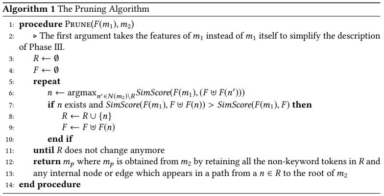

# AROMA代码推荐

AROMA是Facebook开发的代码推荐插件，论文：https://arxiv.org/pdf/1812.01158.pdf
github: https://github.com/facebookresearch/aroma-paper-artifacts

## 代码语法树解析

定义1：一棵简化后的语法树是下面任意元素的列表，一个元素可以是：

1. 一个非关键字标记
2. 关键字标记
3. 简化后的语法树

定义2：一棵语法树的标签是列表中所有元素标签的结合，具体的：

- 如果一个元素是关键字，则该元素的标签就为关键字
- 如果一个元素是非关键字或一棵简化语法树，则用符号 # 表示

例如，简化语法树`["x", ">", ["y", ".", "f"]]` 被表示为 `"# > #"`

下图是一棵简化语法树，叶子上的关键字标记被省略以避免混乱，变量节点以双⚪突出显示。


## 特征化

为防止相同的代码树结构因变量名不同得出不同的特征，将所有变量以符号#VAR进行替代。

引入#VAR需要处理的几类冲突：

### **`if (x > 0) z = 3; 与 if (z > 3) x = 0`**

该类情况下，语法树都表示为`{if##, #=#, # > #, #VAR, #VAR 3, 0}` 的列表，无法确定数字3所在的位置，为此使用以下特征进行确定：

  `(if##,2,3), (#=#,2,3), (#VAR,3)`

第一个块表示`if##`有一个标签为3的叶子节点在第二个子节点中，第二个块表示`#=#`有一个标签为3的叶子节点在第二个子节点中，第三个块传达了以下事实：变量叶节点出现在3之前。

---

### **`if (y > 0) x = -x`**

对于这个块，我们将有3个#VAR，然而却无法表达一个事实：有两个#VAR实际引用了相同的变量。由于我们已经丢弃了变量名，因此没有直接的方法来声明两个变量之间的关系。

相反，我们捕获有关以下事实的特征：相同局部变量的连续使用上下文是相关的。 我们称此类特征为变量使用特征。 例如，x的两种用法的上下文分别是`（1，＃=＃）`和`（1，-＃）`。

第一个上下文对应于x的第一个用法，表示存在一个变量，该变量是标记为`＃=＃`的节点的第一个子代。索引和父节点标签一起形成了此特定变量用法的上下文。 类似地，第二上下文表示x的第二用法。 我们创建一个格式为`（（1，＃=＃），（1，-＃））`的特征，该特征捕获同一变量两次连续使用的上下文之间的关系。

---

现在我们正式描述Aroma如何使代码片段特征化。给定一个简化的解析树，我们为树所代表的程序中的每个非关键字标记n提取四种特征：

1. 形式为`n`的令牌特征。 如果`n`是局部变量，我们将`n`替换为`#VAR`
2. 形式为`(n,i1, L(t1)), (n,i2, L(t2)), (n,i3, L(t3))`的父特征

   此处n表示$t_1$的第$i_1$个子节点，$t_1$是$t_2$的第$i_2$个子节点，而$t_2$是$t_3$的第$i_3$个子节点。正如前言，如果n是局部变量，则使用#VAR进行替换。请注意，在每个特征中，我们均未指定特征中的第三个元素是父级，祖父母级还是曾祖父级。 这有助于Aroma容忍其他相似代码段中的某些非相似性。

3. 形式为`(n, Next(n))`和`(Prev(n),n)`的兄弟特征.

   和以前一样，如果`n，Next（n），Prev（n）`中的任何一个是局部变量，则将其替换为#VAR。

4. 形式为`(C(PrevUse(n)),C(n))`和`(C(n),C(NextUse(n)))`的变量使用特征

   我们只在n为局部变量的时候添加此类特征

对于一个非关键字标记 $n \in N(t)$， 我们使用 $F(n)$来表示从n中提取出的多组特征。我们将F的定义扩展到一组非关键字标记Q，如下所示：$F(Q) = ⊎_{n∈Q} F(n)$,  其中⊎ 表示多个集合的并集。对于一个简化后的解析树$t$，我们使用F(t)表示$t$中所有非关键字标记的多组特征集合，例如，$F(t)=F(N(t))$, 令$\mathcal{F}$为可从给定的代码集提取的所有特征的集合。

## 推荐系统

### 阶段一： 轻量级搜索

在这个阶段，AROMA取得一个query代码段，并输出与query代码段重叠率最高的几种方法（例如，前1000个）。要取得最佳方法，我们需要计算query代码段与所有方法的重叠率。由于代码块包含数以百万的方法，需要保证在查询时的快速计算。我们使用代码段的特征集合来计算重叠率，我们称之为重叠评分。具体来说，AROMA将query代码段的特征集合与方法体的特征集合求交集，交集的基数即作为重叠评分。

计算交集及其基数在计算上相当昂贵。 为了进行有效的计算，我们将代码片段的特征集表示为稀疏向量，并执行矩阵乘法以计算所有方法与query代码的重叠分数。 接下来，我们描述该阶段的正式细节。

给定一个包含数百万个方法的大型代码语料库。 AROMA为每个方法体解析并创建简化的解析树。 然后，它对每个简化的解析树进行特征化。 令M为语料库中所有方法体的简化解析树的集合。 Aroma还解析query代码段以创建其简化的解析树（例如q），并提取其特征。 对于语料库中每个方法体的简化解析树m，我们使用集合$S(F(m)) \cap S(F(q))$的基数作为近似分数，称为重叠分数，表示方法体与查询代码段有多少重叠。 在这里，`S(X)`表示多个集合`X`中的元素的集合，在这里我们忽略了多集合中每个元素的计数。 Aroma计算出$\eta_1$个方法体的列表，这些方法的重叠分数相对于查询代码段而言最高。 在我们的实现中，$\eta_1$通常为1000。

对这些列表的计算可以被简化为矩阵和稀疏向量间的简单乘法。代码块的特征可以被一个长度为$\left|\mathcal{F}\right|$的稀疏向量表示。这个向量在$\mathcal{F}$中的每一个特征都有一个条目。如果一个特征$f_i$存在$F(m)$中，则这个向量中的第$i$个条目为1，其余为0。要理解这个策略，假设$F(m)$中有n个特征$f$，而查询向量$q$中包含这样一个特征$f$，则与查询向量的重叠度将会乘以n，但并不能说明m与q实际上有更好的重叠度。

所有方法体的稀疏特征向量随后可以由一个形状为$\left|M\right| \times \left|\mathcal{F}\right|$的矩阵表示，假设为D。使$v_q$表示查询代码段$q$的特征向量。则$D \cdot v_q$ 的结果为一个$\left|M\right|$维的向量，表示对每个方法的评分。然后选择$\eta_1$个评分最高的方法。

### 阶段二： 剪枝与重排

在以下阶段，我们需要一个子算法来计算出给定两个代码段的最大共用代码段。例如，给定代码段 `x=1; y=2;` 和 `y=2;z=3;`，某个算法应该返回`y=2` 作为两个代码段的交集。这个算法可以用LCS来实现，只需将两个代码块作为字符串看待。这样的算法被用在SNIEF(被用来执行自然语言最小代码片段搜索)中。然而，LCS并不能在此很好工作，由于通常两个代码并非完全相同。为了演示这一点，假设给定两个代码块 `x=1;if (y>1) if(z < 0) w = 4;` 和 `if(z<0) if (y>1) w=4;v=10;`，这里将两个if语句进行了交换。LCS会返回`if (y>1) w=4;` 或者`if (z < 0) w=4;`作为二者的交集。示例中，LCS丢弃了一个非共用的if语句。理想情况下，我们应该有两个if语句，例如，算法应该返回 `if (y > 1) if (z < 0) w = 4;` 或者`if (z < 0) if (y > 1) w = 4;`。

这个示例也表明，当混淆存在时，我们至多会得到两个待选代码段，一个可能与第一个片段更相似，另一个可能与第二个更相似。我们通过复制第二个代码片段，并删除与第一个代码段不相似的部分来处理歧义。也就是说，该算法正在修剪第二个代码段，同时保留与第一个代码段相同的部分。

一个简单的方法是从第二个代码片段找到与第一个代码段的语法树中最相似的子树。然而，这样的算法及其昂贵，毕竟一棵语法树有相当多的子树。作为替换，Aroma使用贪心算法，该算法为我们提供了第二个片段解析树的最大子树。同时，我们也注意到，如果我们可以找到第二个代码段的解析树中所有存在于交集中的叶子节点，我们可以简单的通过获取从根结点到叶子结点路径上的所有结点和边来得到最大子树。接下来，我们正式描述剪枝算法。

假设我们以解析树的形式获得了两个代码段，$m_1$和$m_2$，要计算出最佳简化解析树$m_p$，要求我们计算$m_2$的叶子结点的子集$R$。回想一下，m的叶子结点由$N(m)$表示，并且恰好包含解析树的非关键字标记。集合R应该使得$m_p$和$m_1$之间的相似度最大，我们将使用两个代码块特征集合的交集的基数作为它们的相似分数。也就是，以解析树的形式的两个代码块$m_1$和$m_2$之间的相似度为$\left| F(m_1) \cap F(m_2) \right|$，我们以$SimScore(m_1,m_2)$表示。一旦我们已经计算出存在于交集中的叶子结点的集合$R$，以及$m_2$中任意从根节点到n∈R的路径的内部节点和边，那么$m_p$就是由$R$中的节点组成的子树。 算法1中介绍了用于计算R的贪婪算法：



在这个算法中，变量F维护代码片段的交集，变量R维护交集中叶子结点的集合。最初，该算法从一组空的叶子结点开始，然后，它从第二个代码段的解析树（即$m_2$）迭代地将更多叶子节点添加到集合中。如果节点n的加入加大了第一个代码段（的解析树）和可以从R获得的树之间的相似性，则会添加节点n。由于F保留了可以从R构造的树的特征，因此我们可以通过简单地将与n相关的特征（即F（n））添加到F来获得R∪{n}的特征。 如果找不到这样的节点，该算法将根据R构造子树并将其返回。

我们接下来演示如何使用剪枝算法来重排阶段1中的代码。给定一个查询q，和一个方法体m，针对查询q修剪方法（即Prune(F(q),m))给出了查询和方法都共用的代码段。如果我们考虑查询和修剪后的代码片段之间的相似性评分，则该评分应该是量化查询和方法之间重叠的另一种方式。 我们凭经验发现，如果我们使用此替代得分来对第1阶段中检索到的方法（即N1）进行重排，则我们对搜索结果的排名会略有提高。

在下一阶段，Aroma使用重排列表（我们称为$N_2$）进行聚类和相交。 请注意，剪枝算法是贪婪的，因此我们可能找不到两个代码片段之间的最佳交集。 在第5节中，我们展示了在极少数情况下，贪婪的剪枝算法可能无法为我们提供最佳的推荐代码段。

### 阶段三： 聚类与相交

在最后阶段，Aroma通过对上一阶段的重排搜索结果进行聚类相交来准备建议。 聚类和相交在计算上很昂贵。 因此，我们从搜索结果列表中选择前$η_2= 100$种方法，这些方法与查询的重叠分数高于阈值$τ_1= 0.65$，然后对它们进行最后一个阶段的处理。 在下面的讨论中，我们假设已对$N_2$进行了修改，以包含前$η_2$个搜索结果。

#### 聚类

Aroma将彼此相似的方法体聚集在一起。 聚集步骤对于避免创建冗余推荐是必需的-对于每个群集，仅生成一个建议。 此外，群集中的方法可能包含不必要的无关代码片段。 通过对集群中的代码片段求交集消除这些不必要的代码片段，有助于创建简洁的建议。

集群包含彼此相似的方法体。 具体来说，集群必须满足以下两个约束：

- 如果我们在集群中将代码片段相交，则应该获得一个代码片段，该片段具有比查询片段更多的代码片段。 这样可以确保Aroma的建议（通过对集群中的代码段相交而获得）是对查询代码段的扩展。
- 集群中经过修剪的代码段彼此相似。 这是因为Aroma被设计为执行搜索，可以容忍查询和结果之间的某种程度的差异。 这样，两个代码段可能与查询的不同部分重叠。 如果两个这样的代码片段是集群的一部分，则它们的交集将不包含查询片段。 因此，通过将群集中的所有代码片段相交而获得的建议将不包含查询的任何部分。 这是不可取的，因为我们想要包含查询和一些额外新代码的推荐。

而且，Aroma不要求集群不相交。

由于集群上的这些限制，我们不能简单地照搬教科书集群算法，例如k均值，DBSCAN或亲和传播。 我们最初尝试使用这些聚类算法（忽略约束），但结果很差。 因此，我们开发了一种自定义的聚类算法，其中考虑了约束。 在较高的层次上，聚类算法首先将每个方法体视为一个单独的类。 然后，只要合并的集群满足集群约束并且合并后的集群中推荐代码段的大小最小化，就可以迭代地将一个集群与另一个具有单个代码段的集群合并。 接下来，我们正式描述聚类算法。

我们使用$N_2(i)$来表示列表$N_2$中的第$i$棵树。一个集群是以$(i_1,...,i_k)$表示的元组，这里$\forall 1 \leq j < k  \ \  i_j < i_{j+1}$，元组$(i_1,...,i_k)$表示包含代码片段$N1,...,N_k$的群集。我们定义元组$\tau=(i_1,...,i_k)$的共性得分为:

$$ cs(\tau)= \left| \cap_{1 \leq j \leq k} F(N_2(i_j))  \right| $$

类似地，我们针对查询q定义元组$\tau=(i_1,...,i_k)$的共性得分为:

$$ csq(\tau)= \left| \cap_{1 \leq j \leq k} F(Prunce(F(q), N_2(i_j)))  \right| $$

我们假定一个元组$\tau=(i_1,...,i_k)$是合法的当且仅当：

1. $l(τ)= cs(τ)/ csq(τ)$大于某些用户定义的阈值$τ_2$（在我们的实验中为1.5）。 这样可以确保在与集群中的所有代码段相交之后，我们得到的代码段至少比查询代码代码段大$τ_2$倍。
2. $s(τ)= csq(τ)/ |F(N2(i1))|$ 大于某些用户定义的阈值τ3（在我们的实验中为0.9）。 此要求可确保群集中的树彼此之间不太相似。 具体来说，它表示集群中的修剪片段的交集应与第一个修剪片段的交集非常相似。

聚类算法：

```python
C ← the set {(i) | 1 ≤ i ≤ |N2| and (i) is a valid tuple}.
do
  C ← C ∪ {(i1,...ik,i) | (i1,...ik) ∈ C and ik < i ≤ |N2| and (i1, . . . ,ik ,i) is a valid tuple and ∀j if ik < j ≤ |N2| then l((i1,...,ik ,i)) ≥ l((i1,...,ik,j))}}
while (C does not change anymore)
```

在计算完所有有效的元组之后，Aroma首先在每个元组上按照索引升序排序，然后按照每个元组的长度按降序对它们进行排序。 如果与已排序列表中τ之前出现的任何元组相似（即Jaccard相似度大于0.5），它也会从列表中删除任何元组τ。 这样可以确保推荐的代码段彼此之间不太相似。 令N3为其余簇的排序列表。

#### 相交

Aroma通过对每个群集中的所有片段相交来创建推荐。 交集算法使用算法1中描述的Prune函数，并确保交集不会丢弃作为查询一部分的任何代码片段。 形式上，给定一个元组$\tau=(i_1,...,i_k)$，Intersect（τ，q）返回一个代码片段，该代码片段是代码片段N2(i1),...,N2(ik)的交集，同时确保我们保留与q相似的任何代码。 Intersect((i1,...,ik),q)递归定义如下：

- $Intersect((i_1),q)=Prune(F(q), N_2(i_1))$
- $Intersect((i_1,i_2),q)=Prune(F(N2(i_2)) ⊎ F(q),N_2(i_1))$
- $Intersect((i_1,...,i_j,i_{j+1}),q)=Prune(F(N2(i_{j+1})) \cup F(q),Intersect((i_1,i_2),q))$

在正在运行的示例中，清单5和清单6组成一个集群。 Aroma将查询代码的特征的并集与清单5相对应，清单6作为清单5与清单6之间的交集。清单7中显示了相交的结果，清单7中将其作为从群集中推荐的代码片段返回。

最后，Aroma从N3中选择前K个元组（在我们的实现中，K = 5），并返回每个元组与查询代码段的交集作为推荐。


清单 5.  清单 4 中的方法体，高亮的文本表示在剪枝步骤中选择的标记。


清单 6. 另一个在清单4中包含的查询代码片段，高亮的文本表示在剪枝步骤中选择的标记。


清单 7. 通过对清单5和清单6求交集得到的推荐代码片段，其余的行被高亮显示。

